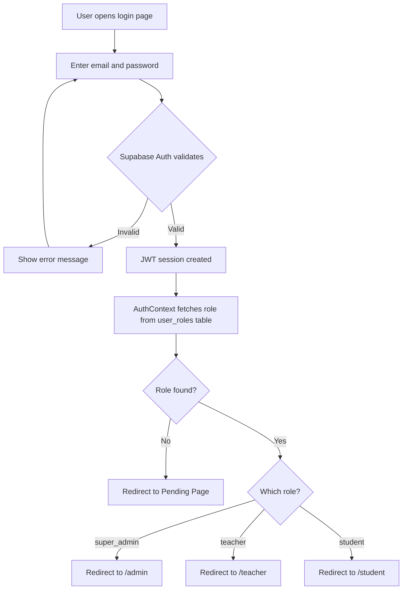
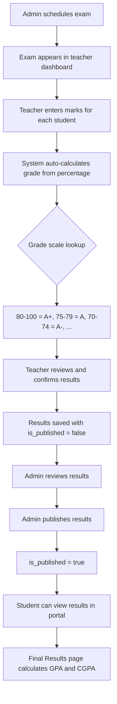
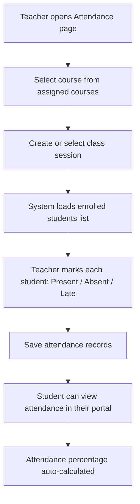

# 🎓 University Management System Portal (UMSP)

> A comprehensive, role-based web application for academic administration — designed as a final year project demonstrating full-stack development with modern web technologies.

---

## Table of Contents

1. [Abstract](#abstract)
2. [Introduction](#introduction)
3. [System Analysis](#system-analysis)
4. [System Design](#system-design)
5. [Detailed Feature Descriptions](#detailed-feature-descriptions)
6. [Grading System & GPA Calculation](#grading-system--gpa-calculation)
7. [Security Architecture](#security-architecture)
8. [Technology Stack](#technology-stack)
9. [Prerequisites](#prerequisites)
10. [Installation & Setup](#installation--setup)
11. [Environment Setup](#environment-setup)
12. [Database Setup](#database-setup)
13. [Edge Functions](#edge-functions)
14. [Running the App](#running-the-app)
15. [Deployment](#deployment)
16. [Project Structure](#project-structure)
17. [License](#license)

---

## Abstract

The University Management System Portal (UMSP) is a web-based application that digitises and streamlines the academic operations of a university department. It replaces manual, paper-based processes — such as attendance tracking, exam scheduling, result publication, and notice management — with a centralised, role-based platform accessible to administrators, teachers, and students.

The system implements **Row Level Security (RLS)** at the database layer, ensuring that every user can only access data they are authorised to view. A **feature visibility control** mechanism allows administrators to toggle entire modules on or off at runtime without code deployment. The public-facing website provides visitors with access to faculty directories, department listings, notice boards, and exam schedules.

Built with React 18, TypeScript, Tailwind CSS, and Supabase (PostgreSQL + Auth + Edge Functions), the application demonstrates modern full-stack development practices including JWT authentication, real-time data queries, and responsive design.

---

## Introduction

### Problem Statement

Traditional university administration relies heavily on manual processes:

- **Attendance** is tracked on paper registers that are prone to errors and loss
- **Exam schedules** are pinned to notice boards, limiting reach and causing miscommunication
- **Results** are published through physical handouts or unstructured emails, with no consolidated GPA/CGPA view
- **Course assignments** between teachers and students are managed through spreadsheets
- **Communication** between students and teachers lacks a structured request/approval workflow
- **Public information** (faculty profiles, department details) is scattered across outdated websites

These inefficiencies lead to data inconsistencies, delayed communication, and a poor experience for all stakeholders.

### Objectives

1. **Centralise academic operations** into a single, web-based platform
2. **Enforce role-based access control** so each user sees only relevant data and actions
3. **Automate grade calculation** with a defined grade scale and GPA/CGPA formulas
4. **Provide real-time access** to schedules, results, and notices from any device
5. **Enable dynamic feature control** to show/hide modules without redeployment
6. **Offer a public-facing website** with faculty profiles, departments, and notice boards
7. **Support secure account creation** where admins generate teacher/student accounts with strong passwords

### Scope

| In Scope | Out of Scope |
|----------|-------------|
| Student, Teacher, and Admin portals | Finance / fee management |
| Attendance tracking per class | Library management |
| Exam scheduling (mid, lab, final) | Hostel / accommodation |
| Result entry with auto-grading | Parent portal |
| Course and department management | Mobile native apps |
| Notice board with types and pinning | SMS/push notifications |
| Public website with faculty profiles | Video conferencing |
| Routine/timetable generation | Plagiarism detection |

### Limitations

- The system assumes a single university with multiple departments — multi-university support is not implemented
- File storage for course notes depends on the configured storage bucket capacity
- The routine generator uses a heuristic algorithm and may not produce optimal timetables for all constraint combinations
- Email verification requires a configured SMTP provider in the backend

---

## System Analysis

### Functional Requirements

#### FR-1: Admin Functional Requirements

| ID | Requirement | Description |
|----|-------------|-------------|
| FR-1.1 | Dashboard Analytics | View total counts of students, teachers, courses, departments, and recent activities |
| FR-1.2 | Department Management | Create, edit, and delete departments with unique codes |
| FR-1.3 | Batch Management | Create student batches with admission session, starting roll, and semester tracking |
| FR-1.4 | Course Management | Add courses with code, credits, contact hours, type (theory/lab), and department assignment |
| FR-1.5 | Room Management | Manage classrooms with capacity and type (classroom/lab) |
| FR-1.6 | Teacher Account Creation | Generate teacher accounts with auto-generated secure passwords |
| FR-1.7 | Student Account Creation | Bulk-ready student account creation with batch assignment |
| FR-1.8 | Exam Scheduling | Schedule mid, lab, and final exams with date, duration, room, and marks |
| FR-1.9 | Result Management | View and manage published exam results with CSV export |
| FR-1.10 | Notice Board | Create, pin, and manage notices with types (urgent, informational, fun) |
| FR-1.11 | Routine Generation | Auto-generate weekly class timetables based on courses, teachers, rooms, and time slots |
| FR-1.12 | Academic Semester Config | Configure semester dates including mid/final exam periods and result publish dates |
| FR-1.13 | Feature Visibility | Toggle visibility of any module across all dashboards |
| FR-1.14 | User Management | View all users and their assigned roles |

#### FR-2: Teacher Functional Requirements

| ID | Requirement | Description |
|----|-------------|-------------|
| FR-2.1 | Dashboard | View assigned courses, upcoming classes, and pending requests |
| FR-2.2 | Course View | Browse all courses assigned by the admin |
| FR-2.3 | Attendance Marking | Mark students present, absent, or late for each class session |
| FR-2.4 | Assessment Creation | Create assessments with title, date, total marks, and per-student marks |
| FR-2.5 | Course Notes | Upload and manage course materials and documents |
| FR-2.6 | Exam Result Entry | Enter marks for exams with auto-calculated grades based on the grade scale |
| FR-2.7 | Request Handling | Review and approve/reject student requests (reschedule, bonus points, extra class) |
| FR-2.8 | Schedule View | View personal teaching schedule and routine |

#### FR-3: Student Functional Requirements

| ID | Requirement | Description |
|----|-------------|-------------|
| FR-3.1 | Dashboard | View performance summary, upcoming exams, and recent notices |
| FR-3.2 | Course Enrollment | View enrolled courses with details (code, credits, teacher) |
| FR-3.3 | Attendance Records | View attendance history with present/absent/late counts and percentages |
| FR-3.4 | Exam Schedule | Browse upcoming mid, lab, and final exams |
| FR-3.5 | Assessment View | Check assessment scores and feedback |
| FR-3.6 | Result View | View individual exam results with grades |
| FR-3.7 | Final Results | Consolidated semester-wise results with GPA and cumulative CGPA |
| FR-3.8 | Notice Board | View notices filtered by type with pinned items at the top |
| FR-3.9 | Request Submission | Submit requests to teachers (class reschedule, exam reschedule, extra class, bonus points) |
| FR-3.10 | Class Schedule | View weekly routine and timetable |

#### FR-4: Public Website Requirements

| ID | Requirement | Description |
|----|-------------|-------------|
| FR-4.1 | Homepage | Animated landing page with university statistics and feature highlights |
| FR-4.2 | Faculty Directory | Searchable list of all teachers with profiles |
| FR-4.3 | Faculty Profile | Individual teacher page with designation, department, and contact |
| FR-4.4 | Department Listing | All departments with codes and descriptions |
| FR-4.5 | Public Notice Board | View published notices |
| FR-4.6 | Exam Schedules | Public view of upcoming exam schedules |
| FR-4.7 | Leadership Page | University leadership and administrative information |

### Non-Functional Requirements

| Category | Requirement | Target |
|----------|-------------|--------|
| **Performance** | Initial page load | < 3 seconds on 3G connection |
| **Performance** | API response time | < 500ms for standard queries |
| **Security** | Authentication | JWT-based with session refresh |
| **Security** | Data isolation | Row Level Security on all tables |
| **Security** | Password generation | 12+ character passwords with mixed characters |
| **Usability** | Responsive design | Functional on screens ≥ 320px width |
| **Usability** | Theme support | Light and dark mode with system detection |
| **Scalability** | Concurrent users | Supports 500+ simultaneous sessions |
| **Reliability** | Data backup | Automated daily database backups (Supabase managed) |
| **Maintainability** | Code structure | Component-based architecture with shared utilities |

---

## System Design

### System Architecture

```
┌─────────────────────────────────────────────────────────────────┐
│                        CLIENT LAYER                             │
│  ┌───────────┐  ┌──────────┐  ┌──────────┐  ┌──────────────┐   │
│  │  React 18  │  │ React    │  │ TanStack │  │  Tailwind    │   │
│  │ Components │  │ Router   │  │  Query   │  │  CSS + UI    │   │
│  └─────┬─────┘  └────┬─────┘  └────┬─────┘  └──────────────┘   │
│        │              │             │                            │
│        └──────────┬───┘─────────────┘                            │
│                   │                                              │
│         ┌─────────▼──────────┐                                   │
│         │  AuthContext        │  ← Session, Role, JWT            │
│         │  FeatureGate        │  ← Runtime visibility control    │
│         │  ProtectedRoute     │  ← Role-based route guarding     │
│         └─────────┬──────────┘                                   │
└───────────────────┼──────────────────────────────────────────────┘
                    │ HTTPS (REST)
┌───────────────────▼──────────────────────────────────────────────┐
│                     SUPABASE LAYER                               │
│  ┌──────────────┐  ┌──────────────┐  ┌──────────────────────┐   │
│  │  Auth (JWT)   │  │  PostgREST   │  │  Edge Functions      │   │
│  │  - Sign in    │  │  - Auto API  │  │  - create-user       │   │
│  │  - Sign up    │  │  - RLS       │  │    (admin-only)      │   │
│  │  - Sessions   │  │  - Filters   │  └──────────────────────┘   │
│  └──────┬───────┘  └──────┬───────┘                              │
│         │                 │                                       │
│         └────────┬────────┘                                       │
│                  │                                                │
│         ┌────────▼────────┐                                       │
│         │   PostgreSQL     │  ← 19 tables, RLS policies          │
│         │   Database       │  ← Enums, functions, triggers       │
│         └─────────────────┘                                       │
└──────────────────────────────────────────────────────────────────┘
```

### Use Case Diagram

```mermaid
graph LR
    Admin((Admin))
    Teacher((Teacher))
    Student((Student))
    Visitor((Visitor))

    Admin --> UC1[Manage Departments]
    Admin --> UC2[Manage Batches]
    Admin --> UC3[Manage Courses]
    Admin --> UC4[Manage Rooms]
    Admin --> UC5[Create Teacher Accounts]
    Admin --> UC6[Create Student Accounts]
    Admin --> UC7[Schedule Exams]
    Admin --> UC8[Manage Results]
    Admin --> UC9[Post Notices]
    Admin --> UC10[Generate Routine]
    Admin --> UC11[Configure Semesters]
    Admin --> UC12[Toggle Feature Visibility]
    Admin --> UC13[View Dashboard Analytics]

    Teacher --> UC14[View Assigned Courses]
    Teacher --> UC15[Mark Attendance]
    Teacher --> UC16[Create Assessments]
    Teacher --> UC17[Upload Course Notes]
    Teacher --> UC18[Enter Exam Results]
    Teacher --> UC19[Handle Student Requests]
    Teacher --> UC20[View Schedule]

    Student --> UC21[View Enrolled Courses]
    Student --> UC22[Check Attendance]
    Student --> UC23[View Exam Schedule]
    Student --> UC24[View Results and GPA]
    Student --> UC25[View Assessments]
    Student --> UC26[Submit Requests]
    Student --> UC27[View Notices]
    Student --> UC28[View Final Results with CGPA]

    Visitor --> UC29[Browse Faculty Directory]
    Visitor --> UC30[View Departments]
    Visitor --> UC31[Read Notices]
    Visitor --> UC32[View Exam Schedules]
    Visitor --> UC33[Visit Homepage]
```



### Activity Diagram — User Login Flow



### Activity Diagram — Exam Result Publishing



### Activity Diagram — Attendance Marking



### Workflow Diagram — Academic Semester Lifecycle

```mermaid
flowchart LR
    A[Admin configures semester] --> B[Admin creates courses]
    B --> C[Admin assigns teachers to courses]
    C --> D[Admin enrolls students in courses]
    D --> E[Admin generates routine]
    E --> F[Teacher conducts classes]
    F --> G[Teacher marks attendance]
    G --> H[Admin schedules mid exams]
    H --> I[Teacher enters mid results]
    I --> J[Admin schedules final exams]
    J --> K[Teacher enters final results]
    K --> L[Admin publishes results]
    L --> M[Student views GPA and CGPA]
```



### Database Schema Overview

The system uses **19 tables** in a PostgreSQL database with Row Level Security:

| Table | Purpose | Key Relationships |
|-------|---------|-------------------|
| `profiles` | User profile data (name, email, phone, avatar, department, designation) | References `batches` for students |
| `user_roles` | Maps users to roles (super_admin, teacher, student) | References `profiles` |
| `departments` | Academic departments with codes | Referenced by batches, courses, rooms, routines |
| `batches` | Student groups by admission year/session | References `departments` |
| `courses` | Academic courses with credits, type, semester | References `departments` |
| `teacher_courses` | Assignment of teachers to courses | References `profiles`, `courses` |
| `enrollments` | Student enrollment in courses | References `profiles`, `courses` |
| `classes` | Individual class sessions | References `courses` |
| `attendance` | Per-student attendance for each class | References `classes` |
| `assessments` | Quizzes, assignments, and in-class evaluations | References `courses` |
| `exam_schedules` | Scheduled exams (mid, lab, final) | References `courses` |
| `exam_results` | Student marks and grades for exams | References `exam_schedules`, `profiles` |
| `notices` | Announcements (urgent, informational, fun) | Optional reference to `courses` |
| `notes` | Course materials uploaded by teachers | References `courses` |
| `requests` | Student-to-teacher requests (reschedule, bonus, extra class) | References `courses` |
| `rooms` | Physical rooms with capacity and type | References `departments` |
| `routines` | Weekly timetable slots | References `batches`, `courses`, `departments`, `rooms`, `profiles`, `academic_semesters` |
| `academic_semesters` | Semester configuration with key dates | Standalone |
| `settings` | Key-value configuration store (feature visibility flags, etc.) | Standalone |

### Entity Relationship Summary

```
departments ─────┬──── batches ──── profiles (students)
                 │                      │
                 ├──── courses ─────┬── enrollments
                 │                  │
                 ├──── rooms        ├── teacher_courses ── profiles (teachers)
                 │                  │
                 └──── routines     ├── classes ── attendance
                                    │
                                    ├── exam_schedules ── exam_results
                                    │
                                    ├── assessments
                                    │
                                    ├── notes
                                    │
                                    └── notices

profiles ── user_roles
settings (standalone key-value store)
academic_semesters (standalone)
```

---

## Detailed Feature Descriptions

### Admin Portal

#### 1. Dashboard Analytics (`/admin`)

The admin dashboard provides a high-level overview of the entire system:
- **Total counts**: Students, teachers, courses, departments, batches, and rooms
- **Recent activity**: Latest notices, exam schedules, and result publications
- **Quick navigation**: Cards linking to each management module

#### 2. Department Management (`/admin/departments`)

Full CRUD operations for academic departments:
- Each department has a unique **code** (e.g., "CSE", "EEE") and **name**
- Departments are referenced by batches, courses, rooms, and routines
- Deletion is prevented if child records exist

#### 3. Batch Management (`/admin/batches`)

Batches group students by admission year:
- Fields: batch name, year, semester, admission session, starting roll number, student count
- Each batch belongs to a department
- A **graduated** flag marks completed batches
- The starting roll number enables sequential student ID generation

#### 4. Course Management (`/admin/courses`, `/admin/courses/:deptId`)

Courses are the central entity of the academic system:
- Fields: code, name, credits, contact hours, course type (theory/lab), semester number
- Courses can be **departmental** or **non-departmental** (shared across departments)
- Department-level view shows courses filtered by department
- Courses link to teacher assignments, enrollments, exams, assessments, and notes

#### 5. Room Management (`/admin/rooms`)

Physical classroom and lab management:
- Fields: room number, capacity, type (classroom/lab), department
- Rooms are referenced in routine generation and exam scheduling

#### 6. Teacher Account Creation (`/admin/teachers`)

Admin creates teacher accounts through the system:
- Uses the `create-user` Edge Function to create an auth user and profile
- **Password generator** creates strong 12+ character passwords with uppercase, lowercase, numbers, and symbols
- Profile includes: full name, email, department, designation, phone
- The teacher is automatically assigned the `teacher` role in `user_roles`

#### 7. Student Account Creation (`/admin/students`)

Similar to teacher creation with batch-specific fields:
- Assigns students to a batch with a student ID (roll number)
- Uses the same secure password generation system
- Automatic `student` role assignment
- Supports bulk account creation workflows

#### 8. Exam Scheduling (`/admin/exams`)

Schedule three types of exams:
- **Mid-term** (`mid`): Mid-semester evaluations
- **Lab** (`lab`): Practical/laboratory exams
- **Final** (`final`): End-of-semester examinations
- Each exam has: title, course, date/time, duration, room, total marks
- Exams appear in both teacher and student portals

#### 9. Result Management (`/admin/results`)

View and manage all exam results across the system:
- Filter by course, exam type, or publication status
- **CSV Export**: Download result data for offline records
- Control result publication (published results become visible to students)

#### 10. Notice Board (`/admin/notices`)

Create and manage announcements:
- **Notice types**: Urgent (red), Informational (blue), Fun (green)
- **Pinning**: Pin important notices to the top of the board
- **Expiry dates**: Optionally set an expiry date for time-sensitive notices
- **Course linking**: Optionally associate a notice with a specific course
- Notices appear on both the student portal and the public website

#### 11. Routine Generation (`/admin/routine`)

Auto-generate weekly class timetables:
- Algorithm considers: courses, assigned teachers, available rooms, time slots, lab groups
- Detects and prevents **room conflicts** and **teacher conflicts**
- Supports **lab continuation** (double periods for lab courses)
- Supports **lab groups** (splitting large batches into groups)
- Generated routines are displayed in a day × period grid

#### 12. Academic Semester Configuration (`/admin/settings`)

Configure the academic calendar:
- Semester name and start date
- Mid-term exam period (start and end dates)
- Final exam period (start and end dates)
- Result publish date
- Next semester start date
- Only one semester can be active at a time

#### 13. Feature Visibility Control (`/admin` — accessible by admin)

Toggle the visibility of any module across all dashboards:
- **28 feature toggles** organised by dashboard (Student, Teacher, Admin)
- When a feature is disabled:
  - The sidebar link is hidden
  - Direct URL access is blocked by `FeatureGate` (redirects to dashboard)
  - Data remains intact in the database
- Useful for phased rollouts or temporarily hiding features during maintenance

#### 14. User Management (`/admin/users`)

View all registered users and their roles:
- Lists all profiles with their assigned role
- Shows account creation dates

---

### Teacher Portal

#### 1. Dashboard (`/teacher`)

Overview of the teacher's academic responsibilities:
- Assigned course count
- Upcoming class sessions
- Pending student requests requiring action
- Quick links to frequently used modules

#### 2. My Courses (`/teacher/courses`)

Browse all courses assigned to the teacher:
- Shows course code, name, credits, type, and enrolled student count
- Each course links to its attendance, assessment, and note management

#### 3. Attendance Marking (`/teacher/attendance`)

Mark attendance for class sessions:
- Select a course, create a new class session (with date, time, room)
- Load the list of enrolled students
- Mark each student as: **Present**, **Absent**, or **Late**
- Historical attendance records are viewable and editable
- Calendar-based view for tracking attendance patterns

#### 4. Assessments (`/teacher/assessments`)

Create and manage quizzes, assignments, and evaluations:
- Fields: title, course, date, total marks
- Enter per-student marks after the assessment
- Students see their marks in their assessment view

#### 5. Course Notes (`/teacher/notes`)

Upload teaching materials:
- Add notes with title, content, and optional file attachment
- Notes are associated with a specific course
- Students enrolled in the course can access the notes

#### 6. Exam Results (`/teacher/results`)

Enter marks for scheduled exams:
- Select an exam from the teacher's assigned courses
- Enter marks for each enrolled student
- System **auto-calculates the grade** based on the percentage and grade scale
- The grade is determined by: `(marks_obtained / total_marks) × 100` → grade lookup
- Results remain unpublished until the admin explicitly publishes them

#### 7. Student Requests (`/teacher/requests`)

Review and respond to student requests:
- Request types: Class Reschedule, Exam Reschedule, Extra Class, Bonus Points
- Each request shows: student name, reason (preset or custom), description
- Teacher can **Approve** or **Reject** with an optional comment
- Teachers can add **emoji reactions** for quick feedback

#### 8. Schedule (`/teacher/schedule`)

View the teacher's weekly teaching schedule:
- Displays the auto-generated routine filtered to the teacher's courses
- Shows day, period, course, room, and batch information

---

### Student Portal

#### 1. Dashboard (`/student`)

Personalised overview of academic life:
- Current semester courses and credits
- Attendance summary with percentage
- Recent exam results and current GPA
- Upcoming exams and deadlines
- Latest notices

#### 2. My Courses (`/student/courses`)

View all enrolled courses:
- Course code, name, credits, type, and assigned teacher
- Enrollment status and details

#### 3. Attendance Records (`/student/attendance`)

Detailed attendance history:
- Per-course attendance breakdown
- Present, absent, and late counts
- Overall attendance percentage
- Date-wise attendance log

#### 4. Exam Schedule (`/student/exams`)

View upcoming examinations:
- Filtered to courses the student is enrolled in
- Shows exam type, date, time, duration, room, and total marks

#### 5. Assessments (`/student/assessments`)

View assessment scores:
- Shows all assessments from enrolled courses
- Displays title, date, marks obtained, total marks, and percentage

#### 6. Results (`/student/results`)

View published exam results:
- Shows grade for each published exam
- Only published results (where `is_published = true`) are visible
- Displays course, exam type, marks obtained, and calculated grade

#### 7. Final Results (`/student/final-results`)

**Consolidated semester-wise academic results with GPA and CGPA:**

- **Semester selection**: Choose by Year (1–4) and Semester (1–2)
- **Result table** per semester showing:
  - Course code and name
  - Credits
  - Grade (colour-coded badge: A+ in emerald, F in red)
  - Grade Point (raw value, e.g., 4.00 for A+)
- **Semester summary**: Total credits, earned credits (excluding F grades), GPA
- **CGPA calculation**: Cumulative GPA across all semesters with a semester-wise breakdown
- **Print support**: Formatted for clean printing

**GPA Calculation Formula:**
```
Semester GPA = Sum(Grade Point Value x Credits) / Sum(Credits)
CGPA = Sum(All Semester Grade Points x Credits) / Sum(All Credits)
```

#### 8. Notices (`/student/notices`)

View announcements:
- Pinned notices appear at the top
- Filtered by notice type (urgent, informational, fun)
- Expiry-aware: expired notices are automatically hidden

#### 9. Requests (`/student/requests`)

Submit requests to teachers:
- **Request types**:
  - Class Reschedule — request to move a class session
  - Exam Reschedule — request to change an exam date
  - Extra Class — request for additional teaching sessions
  - Bonus Points — request for grade consideration
- Each request includes: preset reason (dropdown), custom reason, description
- Status tracking: Pending → Approved / Rejected
- Teacher's comment visible after review

#### 10. Schedule (`/student/schedule`)

View the weekly class routine:
- Displays the generated timetable for the student's batch
- Shows day, period, course, room, and teacher

---

### Public Website

#### 1. Homepage (`/`)

The landing page features:
- Hero section with university branding
- Animated statistics counters (students, teachers, courses, departments)
- Feature highlight cards
- Quick access links to portal login
- Responsive design for mobile and desktop

#### 2. Faculty Directory (`/faculty`)

Searchable list of all teachers:
- Shows name, designation, department, and avatar
- Click to view the full faculty profile

#### 3. Faculty Profile (`/faculty/:id`)

Individual teacher profile page:
- Full name, designation, department
- Contact information (email, phone)
- Profile avatar

#### 4. Departments (`/departments`)

List of all academic departments:
- Department name and code
- Total courses offered per department

#### 5. Public Notice Board (`/notices-public`)

Read-only view of published notices:
- Same notice data as the admin and student views
- Accessible without authentication

#### 6. Exam Schedules (`/exam-schedule`)

Public view of upcoming exams:
- Exam title, course, type, date, and room

#### 7. Leadership (`/leadership`)

University leadership and administration information page.

---

## Grading System & GPA Calculation

### Grade Scale

The system uses a 10-point grade scale with the following mappings:

| Grade | Percentage Range | Grade Point |
|-------|-----------------|-------------|
| A+ | 80 – 100 | 4.00 |
| A | 75 – 79 | 3.75 |
| A- | 70 – 74 | 3.50 |
| B+ | 65 – 69 | 3.25 |
| B | 60 – 64 | 3.00 |
| B- | 55 – 59 | 2.75 |
| C+ | 50 – 54 | 2.50 |
| C | 45 – 49 | 2.25 |
| D | 40 – 44 | 2.00 |
| F | 0 – 39 | 0.00 |

### Grade Calculation

When a teacher enters marks for an exam:

```
Percentage = (Marks Obtained / Total Marks) x 100
Grade = Lookup percentage in grade scale table
```

For example: A student scoring 68 out of 100 → 68% → Grade **B+** → Grade Point **3.25**

### GPA Calculation

```
Semester GPA = Sum(Grade Point x Course Credits) / Sum(Course Credits)
```

**Example:**

| Course | Credits | Grade | Grade Point | Weighted (GP x Credits) |
|--------|---------|-------|-------------|------------------------|
| CSE 101 | 3.00 | A | 3.75 | 11.25 |
| CSE 102 | 3.00 | B+ | 3.25 | 9.75 |
| MAT 201 | 3.00 | A+ | 4.00 | 12.00 |
| PHY 101 | 2.00 | B | 3.00 | 6.00 |

```
Total Credits = 3 + 3 + 3 + 2 = 11
Total Weighted = 11.25 + 9.75 + 12.00 + 6.00 = 39.00
GPA = 39.00 / 11 = 3.55
```

### CGPA Calculation

```
CGPA = Sum(All Semesters Weighted Grade Points) / Sum(All Semesters Credits)
```

CGPA is calculated across all semesters where published final exam results exist. Only courses with a grade other than **F** count towards earned credits, but all courses (including F) are included in GPA/CGPA calculation.

---

## Security Architecture

### Authentication Flow

1. **Login**: User submits email/password → Supabase Auth validates → JWT issued
2. **Session**: JWT stored in browser, auto-refreshed before expiry
3. **Role fetch**: `AuthContext` queries `user_roles` table to determine the user's role
4. **Route protection**: `ProtectedRoute` component checks role before rendering portal content
5. **Logout**: JWT invalidated, session cleared, redirect to login

### Row Level Security (RLS)

Every table has RLS policies enforcing data isolation:

| Policy Pattern | Description |
|----------------|-------------|
| `auth.uid() = user_id` | Users can only access their own records |
| `has_role(auth.uid(), 'super_admin')` | Admin-only access for management tables |
| `has_role(auth.uid(), 'teacher')` | Teachers access their assigned courses/classes |
| Public `SELECT` on `departments`, `notices`, `exam_schedules` | Public website data |

The `has_role()` function is defined as `SECURITY DEFINER` to avoid recursive RLS lookups:

```sql
CREATE FUNCTION public.has_role(_user_id uuid, _role app_role)
RETURNS boolean
LANGUAGE sql STABLE SECURITY DEFINER
SET search_path = public
AS $$
  SELECT EXISTS (
    SELECT 1 FROM public.user_roles
    WHERE user_id = _user_id AND role = _role
  )
$$;
```

### Feature Visibility Gates

Beyond sidebar links, every feature-controlled route is wrapped with `FeatureGate`:

```tsx
<Route path="courses" element={
  <FeatureGate visKey="vis_student_courses" redirectTo="/student">
    <StudentCourses />
  </FeatureGate>
} />
```

This ensures that even direct URL access is blocked when a feature is disabled, redirecting the user to their dashboard.

### Edge Function Security

The `create-user` Edge Function requires a valid admin JWT:
- Extracts the JWT from the `Authorization` header
- Verifies the caller has the `super_admin` role
- Uses the Supabase service role key to create auth users (server-side only)
- Returns the generated password to the admin for communication to the new user

---

## Technology Stack

| Layer | Technology |
|-------|-----------|
| Frontend | React 18, TypeScript, Vite 5 |
| Styling | Tailwind CSS 3, shadcn/ui component library |
| Backend | Supabase (PostgreSQL, Auth, Edge Functions) |
| State Management | TanStack React Query v5 |
| Routing | React Router v6 |
| Form Handling | React Hook Form + Zod validation |
| Charts | Recharts |
| Icons | Lucide React |
| Theme | next-themes (light/dark mode) |

---

## Prerequisites

- **Node.js** 18+ ([install with nvm](https://github.com/nvm-sh/nvm))
- **npm** or **bun** package manager
- A **Supabase** account ([supabase.com](https://supabase.com))

---

## Installation & Setup

```bash
# 1. Clone the repository
git clone <YOUR_GIT_URL>
cd <YOUR_PROJECT_NAME>

# 2. Install dependencies
npm install
# or
bun install

# 3. Create environment file
cp .env.example .env
```

---

## Environment Setup

Create a `.env` file in the project root with these variables:

```env
VITE_SUPABASE_URL="https://YOUR_PROJECT_ID.supabase.co"
VITE_SUPABASE_PUBLISHABLE_KEY="your-anon-key-here"
VITE_SUPABASE_PROJECT_ID="YOUR_PROJECT_ID"
```

**Where to find these values:**
1. Go to [Supabase Dashboard](https://supabase.com/dashboard)
2. Select your project
3. Navigate to **Settings → API**
4. Copy the **Project URL** → `VITE_SUPABASE_URL`
5. Copy the **anon/public** key → `VITE_SUPABASE_PUBLISHABLE_KEY`
6. The project ID is in the URL: `https://supabase.com/dashboard/project/YOUR_PROJECT_ID`

---

## Database Setup

The `setup/` folder contains everything needed to configure a fresh Supabase database:

```
setup/
├── schema.sql         # Complete database schema (all tables, enums, RLS, functions)
├── seed.sql           # Base reference data (departments, batches, rooms, settings)
├── create-admin.md    # How to create the first admin user
└── verify.sql         # Diagnostic script to check database completeness
```

### Quick Setup

1. Open **Supabase Dashboard → SQL Editor**
2. Paste and run `setup/schema.sql` — creates all tables, enums, functions, RLS policies
3. Paste and run `setup/seed.sql` — inserts departments, batches, rooms, default settings
4. Follow `setup/create-admin.md` to create your first admin user
5. Paste and run `setup/verify.sql` to confirm everything is set up correctly

> 📖 See [`setup/README.md`](./setup/README.md) for a detailed walkthrough.

---

## Edge Functions

| Function | Purpose | JWT |
|----------|---------|-----|
| `create-user` | Admin creates teacher/student accounts | Required (admin auth) |

To deploy:

```bash
# Install Supabase CLI
npm install -g supabase

# Link to your project
supabase link --project-ref YOUR_PROJECT_ID

# Deploy the edge function
supabase functions deploy create-user --no-verify-jwt
```

---

## Running the App

```bash
# Development server
npm run dev

# Build for production
npm run build

# Preview production build
npm run preview
```

---

## Deployment

### Apache / Shared Hosting
The `public/.htaccess` file is included for Apache SPA routing. Just upload the `dist/` folder contents to your web root.

### Netlify
The `public/_redirects` file handles SPA routing automatically. Connect your repo and deploy.

### Vercel
Create a `vercel.json`:
```json
{
  "rewrites": [{ "source": "/(.*)", "destination": "/index.html" }]
}
```

### GitHub Pages
The `public/404.html` fallback handles SPA routing on GitHub Pages.

---

## Project Structure

```
├── public/               # Static assets, hosting fallback files
├── setup/                # Database setup toolkit (schema, seed, verify, admin guide)
├── src/
│   ├── components/       # Reusable UI components
│   │   ├── auth/         # ProtectedRoute, FeatureGate
│   │   ├── layout/       # Navbars, sidebars, footers, TopBar
│   │   └── ui/           # shadcn/ui components
│   ├── contexts/         # React contexts (AuthContext)
│   ├── hooks/            # Custom hooks (useFeatureVisibility, useFeatureLock, etc.)
│   ├── integrations/     # Supabase client & auto-generated types
│   ├── lib/              # Utilities (grade scale, feature flags, password generator,
│   │                     #   routine generator, CSV export, university data)
│   └── pages/
│       ├── admin/        # Admin dashboard pages (14 modules)
│       ├── auth/         # Login, sign up, forgot/reset password
│       ├── manager/      # Manager portal (optional — see featureFlags.ts)
│       ├── public/       # Public-facing pages (7 pages)
│       ├── shared/       # Profile page (shared across roles)
│       ├── student/      # Student portal pages (10 modules)
│       └── teacher/      # Teacher portal pages (8 modules)
├── supabase/
│   ├── functions/        # Edge functions (create-user)
│   └── config.toml       # Supabase project configuration
└── .env                  # Environment variables (not committed)
```

---

## License

This project is proprietary. All rights reserved.
